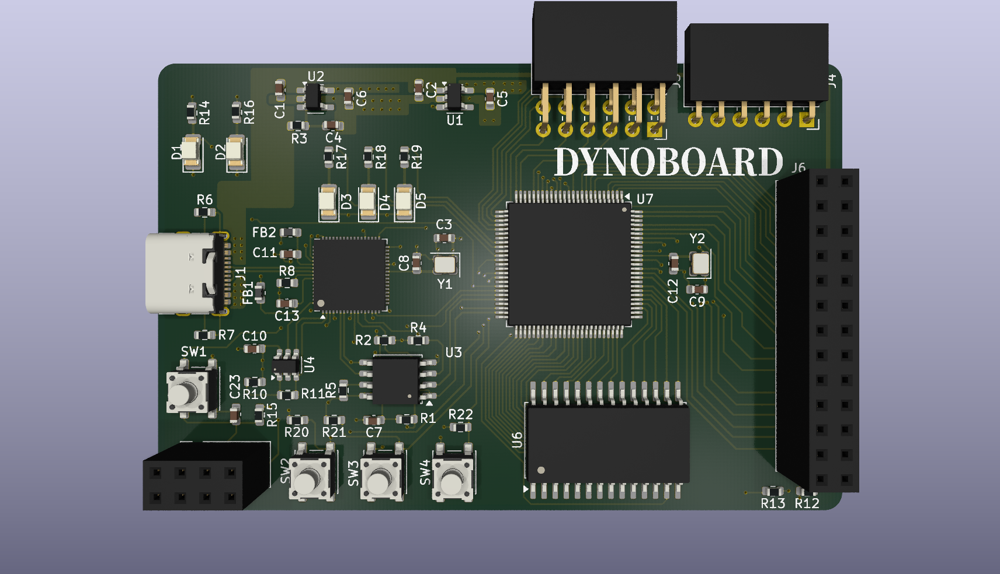
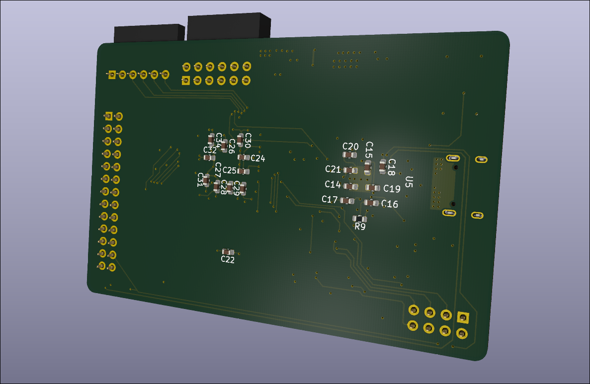
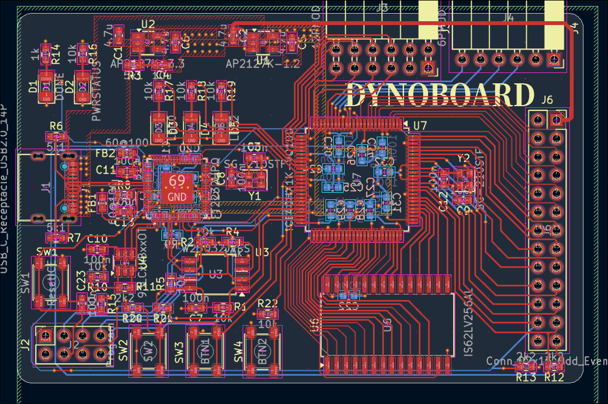

# FPGABoard
This is a FPGA (Field Programmable Array) board that consists of a iCE40 FPGA, FT2232 Programmer, and IO options. It has 2 PMOD headers (12 pin and 6 pin) along with an programming header and 26 pin header for anything else you want to plug in. On the board it has 3 LEDs and 3 buttons, allowing you to interact with the board without plugging anything in

# Why I Made It
I have a decent amount of experience working with microcontrollers but never any with FPGAs. I also want to learn Verilog which allows you to design circuits using programming, so a FPGA board would be perfect for this use case allowing me to experiment with Verilog and designing circuits while also learning something new.

# Pictures

# BOM

To be made